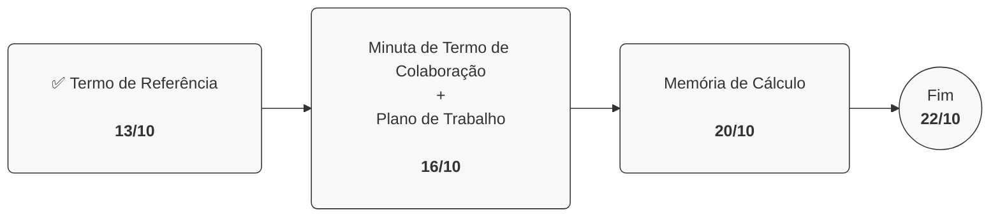

# Projeto: Cine Icaraí
Projeto de modelagem para política pública de gestão cultural do Cine Icaraí em Niterói (RJ).

## Objeto
Elaboração de minuta de Termo de Colaboração (MROSC), plano de trabalho e termo de referência para celebração entre OSC e Prefeitura Municipal de Niterói (RJ), por meio da Secretaria Municipal de Economia Criativa e Ações Estratégicas, via dispensa de chamamento público.

> **Atenção!** O objeto foi definido pelo cliente na ocasião da [Reunião Inicial](reunioes/01-reuniao-inicial.md).

## Produtos esperados
- Minuta de Termo de Colaboração (MROSC) e respectivos:
    - ✅ [Termo de Referência](produto/termo-de-referencia.md)
    - Plano de Trabalho
    - Memória de Cálculo

## Cronograma
Aberto à flexibilidade e necessidades do cliente, o trabalho pretende traçar a seguinte lógica e prazos:

## Autoria
Vivas Cultura e Esporte Ltda. CNPJ sob nº 20.389.940/0001-21. Rua Alvarenga Peixoto, 1408, Santo Agostinho, Belo Horizonte - MG, CEP 30.180-126.

> **Contato:** Solanda Steckelberg - [31 99192-7000](https://wa.link/4anail) - [solanda@vivas.art.br](mailto:solanda@vivas.art.br)

## Destinatários (clientes)
Prefeitura Municipal de Niterói, por meio Secretaria Municipal de Economia Criativa e Ações Estratégicas, com viabilização pela UNESCO Rio.

O uso deverá ser restrito no âmbito do projeto ajustado entre as partes, conforme [Licensa](assets/documents/LICENSE.md).

## Insumos
- Fragmentos de consultoria previamente contratada pelo cliente
- Documentos de referência enviados pelo cliente (via WhatsApp - Solanda)
- Valor (repasse prefeitura Niterói): R$ 6M/ano, ou R$ 3M pelos 6 meses.
- Sem captação (caráter temporário, semestral e excepcional)
- 100% de gratuidade das atividades é obrigatório
- Média atual de visitação = 22k/mês
