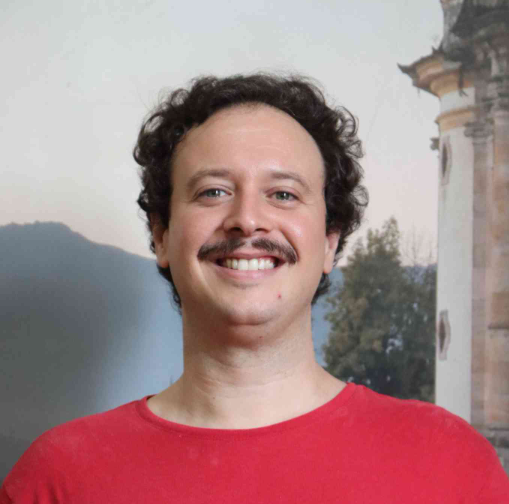

# Quem somos? 🤓

Muito prazer! Eis aqui um pouquinho sobre nós: **Solanda Steckelberg** e **Lucas Fainblat**

## Solanda Steckelberg

=== "Foto"

    

=== "Bio"

    Sou gestora cultural, empreendedora social e jornalista, apaixonada por promover o acesso à cultura, fortalecer territórios e valorizar patrimônios. Mineira com um pé no Maranhão, possuo mais de 30 anos de experiência na gestão de projetos culturais, articulação de políticas culturais, gestão de espaços e equipamentos, produção de eventos e inovação para os setores público e privado.

    - 🎨 Fundadora do Instituto Vivas (MG) e Instituto Tatajuba (MA)  
    - 📧 [solanda.ssberg@gmail.com](mailto:solanda.ssberg@gmail.com)

=== "Experiência"

    | Período      | Instituição                                                              | Cargo                                                  |
    |--------------|--------------------------------------------------------------------------|--------------------------------------------------------|
    | 2024-hoje    | Instituto Vivas                                                          | Diretora-presidente                                    |
    | 2022-hoje    | Instituto Tatajuba (MA)                                                  | Diretora-presidente                                    |
    | 2011-2013    | Fundação Clóvis Salgado                                                  | Presidente                                             |
    | 2008-2010    | Grupo Bonsucesso                                                         | Superintendente de negócios culturais e esportivos     |
    | 2003-2006    | Secretaria de Comunicação da Presidência da República (Brasília)          | Coordenação de eventos e patrocínios oficiais          |
    | 2001-2008    | Fundação Municipal de Cultura de Belo Horizonte                          | Coordenadora de centros culturais e festivais          |

=== "Formação"

    - Bacharelado em Comunicação Social (Relações Públicas e Jornalismo) pela **PUC Minas**
    - Especialização em Comunicação e Gestão Empresarial pela **PUC-MG/IEC**
    - Diversos cursos livres e extensões em Gestão Cultural, Patrimônio e Projetos Socioculturais

=== "Mais"

    - 🏅 Expertise em gestão de espaços culturais, políticas públicas e captação de recursos
    - 🌎 Projetos multipremiados e atuação estratégica em programas de transformação territorial
    - 📊 Mais de 700 ações culturais e formativas coordenadas em 2024, com impacto na geração de renda
    - 🖼️ Liderança na produção de grandes exposições, óperas e festivais com destaque nacional e internacional
    - 📚 Experiência em assessoramento, planejamento e gestão de espaços culturais como Usina do Gasômetro, Cine Theatro Brasil–Vallourec e Casa Fiat de Cultura
    - 💼 Consultoria para projetos de instituições como Instituto Unimed-BH e Instituto Odeon
    - 🌱 Compromisso com diversidade, inovação social e economia criativa

## Lucas Fainblat

=== "Foto"

    

=== "Bio"

    Sou administrador público e músico apaixonado pela cultura brasileira. Natural de Belo Horizonte (MG), possuo 14 anos de serviço público efetivo no Governo de Minas, com atuação destacada na Secretaria de Estado de Cultura e Turismo (Secult-MG) e no Instituto Estadual de Patrimônio Histórico e Artístico (Iepha-MG). Como docente, ministro disciplinas periodicamente para cursos de graduação em administração pública da UFMG e da FJP.

    - 👔 Especialista em Políticas Públicas e Gestão Governamental (EPPGG)  
    - 📧 [lucas.fainblat@iepha.mg.gov.br](mailto:lucas.fainblat@iepha.mg.gov.br)  
    - 🎓 [http://lattes.cnpq.br/1511692902967161](http://lattes.cnpq.br/1511692902967161)  

=== "Experiência"

    | Período      | Instituição     | Cargo  |
    |--------------|-----------------|---------------------------------------------|
    | 2024-hoje    | Instituto Estadual do Patrimônio Histórico e Artístico (Iepha) | Assessor na Assessoria de Parcerias e Programas Integrados (APPI) |
    | 2023-2024    | Secretaria de Estado de Planejamento e Gestão (Seplag) | Assessor-Chefe de Desenvolvimento de Capacidades em Estratégia e Inovação (ADCEI) |
    | 2012-2023    | Secretaria de Estado de Cultura e Turismo (Secult) | Assessor-Chefe de Estratégia (AEST) |
    | 2010-2011    | Secult          | Estagiário                                  |
    | 2009-2010    | Polícia Civil de Minas Gerais (PCMG) | Estagiário                                  |
    | 2006-2011    | Autônomo        | Técnico em informática                      |

=== "Docência"

    | Período | Instituição | Curso | Disciplina | Carga horária | Links |
    | ------- | ----------- | ----- | ---------- | ------------- | ----- |
    | 2024-2  | FJP         | Graduação em Administração Pública | Ônus administrativos: o Caronte entre o cidadão e seus direitos | 30h | [Ementa](https://drive.google.com/file/d/1TcihelHycBf-9fT-Txt-t0Ognn_0YCLz/view?usp=sharing)  [Aulas](https://kumu.io/fainblat/fjp-202501#onus-administrativos) |
    | 2024-1  | FJP         | Graduação em Administração Pública | Quem entra e quem fica de fora - reprodução de desigualdades na implementação de políticas públicas | 30h | [Ementa](https://drive.google.com/file/d/1Cvuyu2KxzrRIJzxdTdsEKAP_-L1ZpbAL/view?usp=sharing)  [Aulas](https://slides.com/lucasfainblat/desigualdades) |
    | 2023-2  | FJP         | Graduação em Administração Pública | Inovação de Impacto: soluções *no code* e *low code* para entraves comuns aos órgãos e entidades do Estado | 30h | [Ementa](https://drive.google.com/file/d/1jgNdQWoFCHCaVDK5o_dhaG_tyh7Rq5fO/view?usp=sharing)  [Aulas](https://drive.google.com/file/d/1-n8rZjmgdTnNvnlGTaJKyeL2ASDemWGT/view?usp=sharing) |

=== "Formação"

    - 2024-2027 (conclusão estimada): Doutorado em Ciência Política pela **Universidade Federal de Minas Gerais - UFMG**
    - 2022-2024: [Mestrado em Ciência Política](https://repositorio.ufmg.br/items/2b5d7e5a-052a-4ed8-9bb6-004e6cef8bd6) pela **UFMG**
    - 2015-2016: [Especialização em Políticas Públicas](https://repositorio.ufmg.br/items/38fe0825-a260-4586-a425-0a0d22b36502) pela **UFMG**
    - 2008-2011: [Bacharelado em Administração Pública](https://drive.google.com/file/d/1PEOnUQqomcOlZDhZZO3UcgjIvEBBPv2E/view?usp=sharing) pela **Fundação João Pinheiro - FJP**

=== "Mais"

    - 🗣️ Inglês e espanhol avançados (leitura, escrita, compreensão e fala)
    - 🎧 Ouça os álbuns [Noite de Estreia (2019)](https://music.youtube.com/playlist?list=OLAK5uy_nmreMVMtyJVugP-y9Ix5_g-yqYsl-2yLw) e [Universo Carapuça (2015)](https://music.youtube.com/playlist?list=OLAK5uy_nDuJGj1sDsBBminPMQgBd8QN9AYXKJHzg)
    - 📻 Radialista: produtor e apresentador do programa **Blablablá do Fainblat**, que foi ao ar semanalmente pela **Rádio Inconfidência** entre 2014 e 2017
    - 🐓 Galô! Meu momento celebridade: personagem no documentário [O Dia do Galo](https://www.youtube.com/watch?v=65Iz_GKbhHk), de Cris Azzi (versão longa [aqui](https://www.youtube.com/watch?v=-O3ZcP7Pwns))
    - 📵 De-tes-to redes sociais, por isso você não me encontrou em nenhuma - pelo menos nenhum perfil verdadeiro 😅
